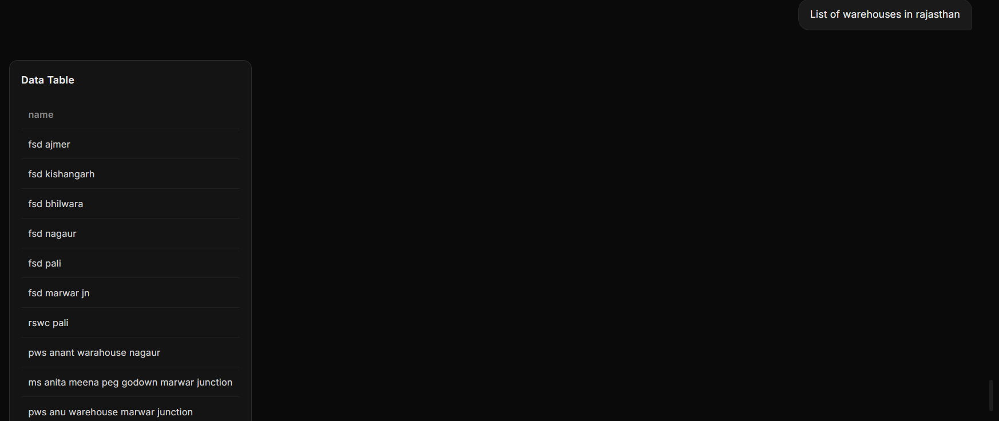

# Conversational-Interface 
A framework for building conversational interfaces that return structured, 
multi-modal responses.

## What it does

You ask a natural language question. Instead of a plain text answer, you get:
- 🗺️ Interactive maps with clickable markers (location queries)
- 📊 Tables (list/comparison queries)  
- 🔷 Polygon overlays on maps (region-based queries)
- 🔘 Choice elements (guided flows)

## Live Demos built on this framework

### Echo Bot
A simple echo server — the base template for building new assistants on this framework.

### Campus Assistant
Ask questions about IIIT Sri City campus — buildings, facilities, navigation.
Uses Llama 3.2 via Ollama for natural language understanding.

### AgriGuard Integration
Ask "show all mandis in Kerala" → renders interactive map with clickable markers.
Ask "list warehouses in Rajasthan" → renders a structured table.
Built by a collaborator, integrated into this framework as a real-world use case.




## Tech Stack
React (Vite) · Flask · Llama 3.2 (Ollama) · Leaflet.js · Recharts · AWS EC2 · Nginx

# Directory Structure
```text
conversational-interface/
├── cloud-setup/
│   └── README.md
│
├── server/
│   ├── backend/
│   │   ├── echo-server/
│   │   │   ├── app.py
│   │   │   ├── requirements.txt
│   │   │   └── README.md
│   │   │
│   │   ├── legalos/
│   │   │    ├── app.py
│   │   │    ├── requirements.txt
│   │   │    ├── README.md
│   │   │    └── legalos_package/
│   │   │ 
│   │   │
│   │   └── campus-assistant/
│   │           ├──app.py
│   │           ├──data.json
│   │           ├──README.md
│   │           └──requirements.txt
│   │
│   │         
│   │
│   └── frontend/       
│       ├── styles.css
│       ├── App.jsx
│       ├── main.jsx
│       ├── components/
│       │   ├── ChatInput.jsx
│       │   ├── ChatMessage.jsx
│       │   └── ChatMessages.jsx
│       └── README.md
│
├── index.html
├── .gitignore
├── vite.config.js
└── README.md


                    

   ``` 
 
## Getting Started
1.Clone the repository
```
  git clone https://github.com/Karthik-124/Conversational-ui
  cd Conversational-ui
  ```


